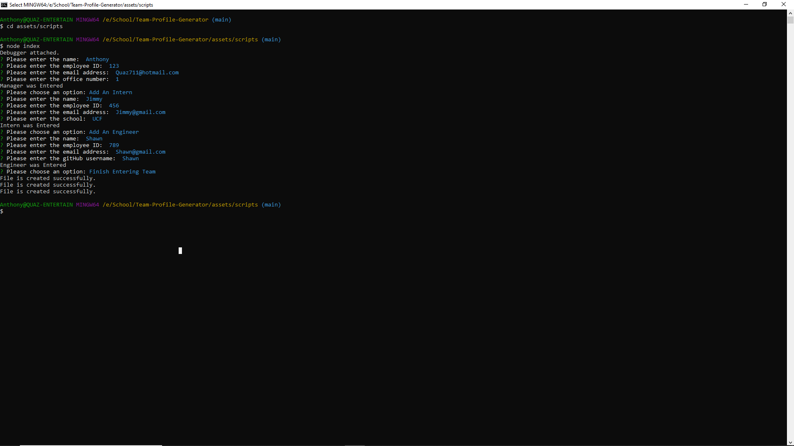
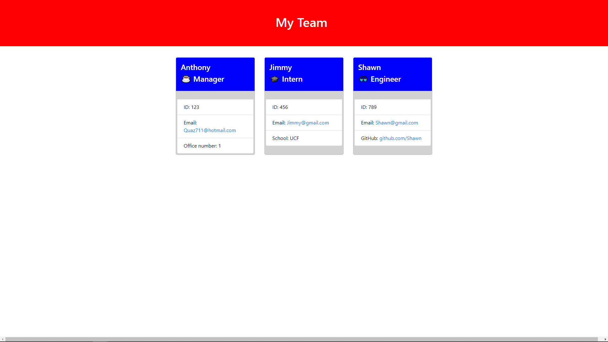

# Team-Profile-Generator

  ## License: MIT License 
  ###  https://choosealicense.com/licenses/mit/

  ## Description
  A program that is designed to generate informtaion about a manager's team and provides detailed information for the manager on each employee

  ## Table of Contents 
  - [Installation](#installation)
  - [Usage](#usage)
  - [Contribution](#contributing)
  - [Testing](#tests)
  - [License](#license)
  - [Images](#images)
  - [Walkthrough](#walkthrough)
  - [Questions?](#questions)
    
  ## Installation:
  Inquirer version 8.2.4 is required to run this application

  ## Usage:
  Install inquirer by opening your console in the directory this application is stored in and run "npm i inquirer@8.2.4"

  ## License:
  MIT License

  ## Contributing:
  If you would like to contribute you may contact me with my information below

  ## Tests:
  The application has test scripts and can be run using jest

  ## Images:
  Screenshots of the application running
  

  

  ## Walkthrough:
  Video of the application running
  [Screencastify](https://drive.google.com/file/d/1egN9I7tgZbibThmoLwz94jsdYwYq-vHV/view)

  ## Questions?:
  - Github: [Quaz711](https://github.com/Quaz711)
  - Email: Quaz711@hotmail.com
  - Additional: You can email me if you have any questions, concerns, or comments